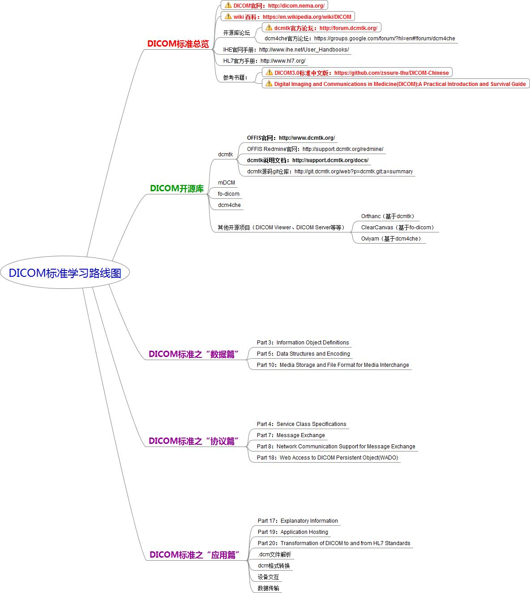

DICOM学习笔记
=============

DICOM协议属于OSI七层模型中的应用层，与HTTP协议类似。
两者有着许多相类似的地方，可以通过类比DICOM与HTTP来介绍DICOM协议，这样可以快速地对DICOM协议有一个宏观的把握。

+-------+---------------------------------+------------------------------------------------------------+
| 对比  | HTTP                            | DICOM                                                      |
+=======+=================================+============================================================+
| OSI层 | 应用层                          | 应用层                                                     |
+-------+---------------------------------+------------------------------------------------------------+
| 数据  | HTML文件                        | .DCM文件                                                   |
+-------+---------------------------------+------------------------------------------------------------+
| 服务  | GET、POST、HEAD、PUT            | C-ECHO、C-FIND                                             |
|       |                                 |                                                            |
|       |                                 | C-STORE、C-MOVE、C-GET                                     |
|       |                                 |                                                            |
|       | DELETE、TRACE、CONNECT、OPTIONS | N-GET、N-SET、N-ACTION                                     |
|       |                                 |                                                            |
|       |                                 | N-CREATE、N-DELETE、N-EVENT-REPORT                         |
+-------+---------------------------------+------------------------------------------------------------+
| 应用  | 互联网B/S模式                   | C/S模式                                                    |
|       |                                 |                                                            |
|       | 也可以用于C/S模式               | 也可以用于WADO（B/S模式）                                  |
+-------+---------------------------------+------------------------------------------------------------+

简而言之：将DICOM协议当作是专属于医疗领域的“HTTP”传输协议，常见的HTTP协议是通过表中的各种服务来实现浏览器与服务器之间HTML格式数据的传输；
DICOM协议是通过上表中的各种服务实现了\ **医疗设备**\ 与\ **数据中心**\ 之间\ **DCM格式数据**\ 的传输。

.. note::

    虽然在互联网中经常会混淆HTTP与HTML两个概念，但从缩写上来看还是比较好区分的：一个是网络传输协议（HTTP），一个是数据格式标记语言（HTML），在HTTP协议中发送的正是HTML格式的数据。

    进入到DICOM领域可能更容易混淆，因为在DICOM领域，传输使用的协议和协议上传输的数据都叫做DICOM，一个称之为DICOM协议，一个称之为DICOM图像（即.dcm后缀的文件）。

DICOM整体思维导图：

.. toctree:: 
    :maxdepth: 1
    :caption: Contents: 

    protocol/index

--------------

原文地址：\ `DICOM：DICOM标准学习路线图 <https://blog.csdn.net/zssureqh/article/details/49231303>`__
