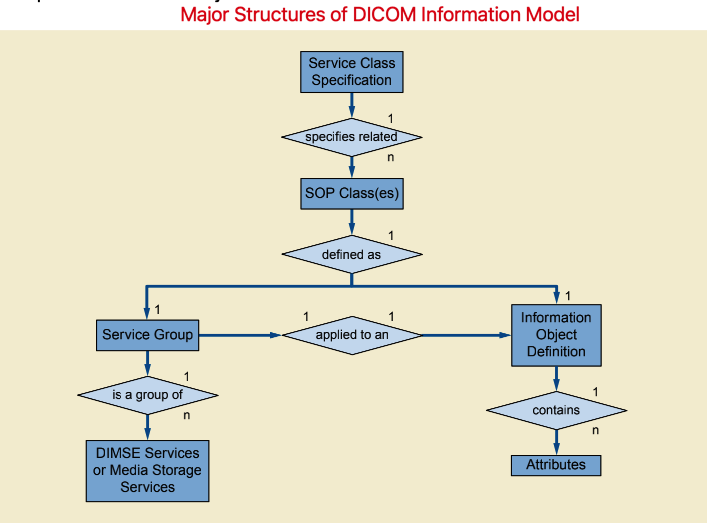

DICOM Information Model
=======================

The DICOM Information Model defines the structure and organization of the information related to the communication of medical images.

* Service Class Specification中定义了SOP Class(es);
* SOP = Service + Object，Object即IOD，表示数据类型，Service表示对该IOD的一组操作。所以，SOP表示的就是一种数据类型，以及对该数据类型的一组操作。

Information Object Definition
-----------------------------

An Information Object Define (IOD) is an object-oriented abstract data model used to specify Information about Real-World Objects. 

An IOD does not represent a specific Instance of a Real-World Object, but rather a class of Real-World Objects that share same properties. 
An IOD used to generally represent a single class of Real-World Objects is called a **Normalized Information Object**. 
An IOD that includes information related Real-World Objects is called a **Composite Information Object**. 

.. note::

    可以借助编程中的一些概念来理解IOD。

    在面向过程的程序设计中，算法 + 数据结构 = 程序，IOD可以理解为数据结构。
    在面向对象的程序设计中，对象包含属性和方法，IOD可以理解为属性。

    总之，IOD是DICOM中的数据类型，表示现实世界中的实体的数据模型。

    可以把IOD理解为结构体类型。

Normalized IOD
**************

A Normalized IOD is an Information Obejct Definition that generally represents a single entity in the DICOM Model of the Real World. 

.. note::

    Normalized IOD是对现实世界中的某一类实体抽象而得到的，一个Normalized IOD对应一种现实世界中的实体。

Composite IOD
*************

A Composite IOD is an Information Object Definition that represents parts of several entites included in the DICOM Model of the Real World. 
Such an IOD includes Attributes that are not inherent in the Real-World Object that the IOD represents but rather are inherent in related Real-World Objects.

.. note::

    Composite IOD并不是直接从现实世界中的实体抽象而来的，而是把若干种实体的部分属性组合在一起得到的一个复合类型。

Attributes
----------

The Attributes of an IOD descirbe the properties of a Real-World Object Instance. 
Related Attributes are grouped into Modules that represent a higher level of semantics.

Attributes are encoded as Data Elements using the rules, the Value Representation and the Value Multiplicity concepts.

.. note::

    如果把IOD理解为结构体类型，那么Attributes就是结构体的数据成员。
    在经过Value Encoding之后，一个IOD实例就是一个Data Set，Attributes就是Data Set的Data Elements。

    对于常用的IOD和Attributes，DICOM标准中都已经做了定义。

On-line Communication and Media Storage Services
------------------------------------------------

For on-line communication the DIMSE Services allow a DICOM Application Entity to invoke an operation or notification across a network or a point-to-point interface. 

For media storage interchange, Media Storage Services allow a DICOM Application Entity to invoke media storage related operations.

.. note::

    Services表示对数据类型(IOD)的操作。
    在DICOM中，Services可以分为两大类：DIMSE Services和Media Storage Services。

DIMSE Service Group
-------------------

A DIMSE Service Group specifies one or more operations/notifications that are applicable to an IOD.

* **DIMSE-C Services**

DIMSE-C Services are services applicable only to Composite IOD, except for C-FIND that may apply to both Normalized and Composite Instances. 
DIMSE-C Services provide only operation services.

* **DIMSE-N Services**

DIMSE-N Services are services applicable only to Normalized IOD. 
DIMSE-N Services provide both operation and notification services.

Service-Object Pair Class (SOP Class)
-------------------------------------

SOP = Service + Object. 

* Object, 即IOD，表示数据类型；
* Service，表示应用于IOD的一组操作。

SOP描述的是某种数据类型以及作用于该数据类型上的一组操作。

Normalized an Composite SOP Classes
***********************************

DICOM defines two types of SOP Classes, Normalized and Composite. 
For DIMSE Services, Normalized SOP Classes are defined as the union of a Normalized IOD and a set of DIMSE-N Services, while Composite SOP Classes are defined as the union of Composite IOD and a set of DIMSE-C Services. 
Media Storeage Services only support Composite IODs and Web Services supports both Nomrlized and Composite SOP Classes.

Association Negotiation
-----------------------

Association establishment is the first phase of communication between peer DICOM compliant Application Entities. 
The Application Entities shall use association establishment to negitate which SOP Classes can be exchanged and how this data will be encoded.

.. note::

    对于网络通信，第一步的操作通常都是建立连接。
    在DICOM中，把连接叫做Association，更通俗的名称其实是Connection。

Service Class Specification
---------------------------

A Service Class Specification defines a group of one or more SOP Classes related to a specific function that is to be accomplished by communicating Application Entites. 

.. note::

    一个SOP Class描述的是某种数据类型(IOD)以及作用于该数据类型的一组操作，Service Class Specification则定义了有哪些SOP Class(es)。
