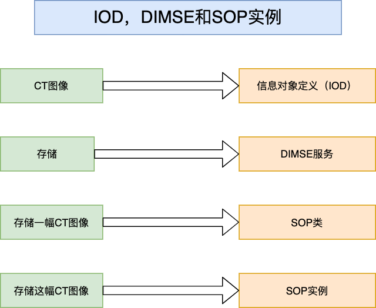

DICOM中的一些重要概念
=====================

IOD (Information Object Definition)
-----------------------------------

IOD是对现实世界中的实体进行的抽象数据化，是现实世界中的实体的数据模型。

每一个信息实体是现实世界中医疗实体（如患者、图像等）的一个数据抽象，这样的实体被称为信息对象，因为它们的功能就在于承载信息。
对于怎样构造信息对象的定义在DICOM中被称为信息对象定义（Information Object Definition）。

在DICOM世界中，包括患者、检查、医学设备等都可以被视为具有不同特性（Property）或者属性（Attribute）的对象。
所有这些对象的属性或者特性的定义都已经在IOD中标准化了。
我们可以将这些IOD视为attribute和description的一个集合，通常一个患者的IOD包括姓名、病历号（Medical Record Number）、性别、年龄、体重、吸烟史等，从另一个方面来说，一个患者是由多个标准的DICOM属性来描述或者组成的。

信息对象定义的实质是一个属性列表。信息对象实例的创建是为属性分配数值。

信息对象定义就像一张包含很多空白字段的表格，例如患者姓名、病案号这样的信息片段都可以作为一个属性。
这个空白代表了一定的信息结构意义。
当表格中的空白被填满，属性被赋予了数值后，对象就有了具体的实际意义：它可能代表一个患者，一幅影像或者其它什么对象。
这个填表的过程，也就是为属性分配数值的过程，就是创建信息对象实例。

IOD分为两大类：

* Normalized IOD (N-IOD)

遵从面向对象的设计原则，不包含除子对象属性外的任何新属性。

.. note::

    对现实世界中的某一类对象抽象而得到，不包含与该类对象无关的属性，也只能表示这一类的对象。

* Composite IOD (C-IOD)

继承复杂数据及结构。

.. note::

    并不是对现实世界中某一类对象的抽象，可能是对若干种对象进行抽象，将它们的数据模型组合在一起，是一种复合类型。

在DICOM标准中，已经定义了很多IOD。。

DIMSE (DICOM Message Service Element)
-------------------------------------

在C/S这种架构中，服务是一个很常用的概念。服务端提供某些服务，客户端向服务端发送服务请求，请求服务端完成某种功能。
服务，就是服务端的某种功能。

在DICOM中，服务的概念与此类似，\ **表示实现某种功能的方法，完成一个相对完整的要求和任务**\ 。

**DICOM将其复杂的服务分解成一些小的服务元素，称为DICOM消息服务元素，简称DIMSE。**

按照所要实现的功能，DIMSE可以分为两类：

* 操作服务（比如“存储”服务可以把信息写入存储设备）
* 通知服务（比如“事件报告”用来通知设备有事发生）

另一个分类标准：

* 对于复合信息对象（Composite IOD）定义了五种DIMSE，叫做DIMSE-C
* 对于规范户信息对象（Normalized IOD）定义了六种DIMSE，叫做DIMSE-N

SOP (Service-Object Pair)
-------------------------

IOD表示的是数据，DIMSE表示的是服务。
将信息对象和DIMSE服务结合在一起，成为DICOM标准中的基本功能单元，叫做服务对象对（Service-Object Pair），简称SOP。
**表示Application Entity提供的针对不同对象（IOD）的相应能力。**

例如，某一台设备支持MR image Storage SOP Class，那就表示它可以存储MR图像。
反之，若是一台CT设备支持要支持DICOM存储，则它必须支持CT image Storage SOP class。

**可以将SOP理解为AE的功能接口，它描述了AE针对不同对象的服务能力。**

分类：

* 标准型SOP = N-IOD + DIMSE-N
* 复合型SOP = C-IOD + DIMSE-C

SOP类和SOP实例：一个SOP类的一个具体实现称做SOP实例，类似于C++语言中类与对象的概念。

对于一个特定的SOP来说，一台装置可能扮演以下两个角色：一是服务的提供者（Service Class Provider，SCP），扮演了这个角色的机器提供SOP类的服务，它相当于C/S模型中的服务器；
二是服务类使用者（Service Class User，SCU），扮演这个角色的装置使用SOP类服务，它相当于C/S模型中的客户端。
例如一台成像装置A需要打印一幅图像，在这种情况下，该成像装置为打印相关的SOP的SCU端，打印机为相应的SCP端。
需要注意的是，当另一台设备B要求此成像装置A发送一幅图像时，A担当起了发送SOP的SCP端，B作为相应的SCU端。
即一台符合DICOM标准的设备可以担当SCU端、SCP端、或者既是SCU又是SCP，视具体SOP需要决定。

有哪些可用的SOPs，DICOM标准中也做了定义，具体可以在下面的网址查看：https://www.dicomlibrary.com/dicom/sop/

AE (Application Entity)
-----------------------

Application Entity代表DICOM通信网络中的一个终端（或者说节点），可以表示一个程序、一个系统或者一台电脑。
每个AE拥有一个唯一的Application Entity Title (AET)。AET的要求是不能超过16个字节，一个设备上面可以有很多个AE。

AE既可以是一个成像设备（Modality），也可以是一个PACS Server，也可以是QA Client Machine，等等等等。

AET (Application Entity Title)
------------------------------

AET是AE在DICOM通信网络中的标识符，用来区分不同的AE。
在一个DICOM通信网络中，AET必须是唯一的，不能有重复。

.. note::

    AET之于AE，就像人的名字一样，每个人都有一个名字，起到标识的作用。

Association
-----------

Association就是Connection，只不过在DICOM中习惯叫做Association。

在网络通信中，第一步的操作通常是建立连接（建立双方通信，信息传输的通道）。
两个AE如果想要通信，必须由一方发起一个Association，这个就是SCU，并且询问另一方（SCP）是否支持具体的功能。

SCU和SCP之间交互的简单流程如下：

* SCP已经启动，正等待来自SCU的请求；
* SCU请求建立连接，SCP接收关联建立请求，这时关联建立成功；
* SCU发送数据，SCP接收数据；
* 终止SCU和SCP之间的关联。

VR (Value Representation)
-------------------------

C语言里有很多数据类型，比如整型、浮点型等。

DICOM世界里的所有数据类型，为了“表达的准确性和普适性”，偏偏就不叫数据类型，而叫“数值代表”，即VR。

比较常见的VR有：

* UI - Unique Identifier (maximum length: 64 characters)
* CS - Code String (maximum length: 16 characters)
* ST - Short Texts

很多DICOM通讯中的问题，是设计者因为对VR的理解不透彻造成的。
比如一个特别值得注意的问题是：DICOM标准对一些VR的长度都做了限定。不遵守这些限定，写出来的软件就会有较差的DICOM兼容性（比如生成了某个UID多于64个字符）。
此外，不管VR的长度是否有限定，它一定是个偶数。如果遇到奇数长度，应以尾部空格补足。自然，这样和别的系统通信的时候会遇到问题。

VR的定义可以在下面的网址中查看: http://dicom.nema.org/medical/dicom/current/output/chtml/part05/sect_6.2.html#table_6.2-1

Transfer Syntax
---------------

Transfer Syntax定义的是数据的编码规则，具体的字段定义可以在下面的网址中查看到: https://www.dicomlibrary.com/dicom/transfer-syntax/

.. note::

    Transfer Syntax可以简单理解为HTTP服务中Header里的Context-Type。

Attribute
---------

Attribute就是IOD的属性。
每一个Attribute最重要的是Tag，Value Representation (VR)和Value。
其中Tag是Attribute的唯一标识，不同的Attribute的Tag都不一样。VR表示Attribute的值类型，Value是Attribute具体的值。

.. note::

    就像定义一个变量时，有类型、变量名和值（Type Name = Value），VR就是类型，Tag就是名称，Value就是值。

Conformance Statement
---------------------

数以百计的DICOM设备生产厂商提供了各种各样的DICOM设备，每一个DICOM设备都会实现自己的一套DICOM一致性声明（Confirmance Statement），
这份声明会说明提供了哪些SOP，可以有哪些扩展。这些一致性声明是作为了解一个DICOM相关工程最好的路线图，它可以帮助你知道可以做什么，以及不能做什么。

