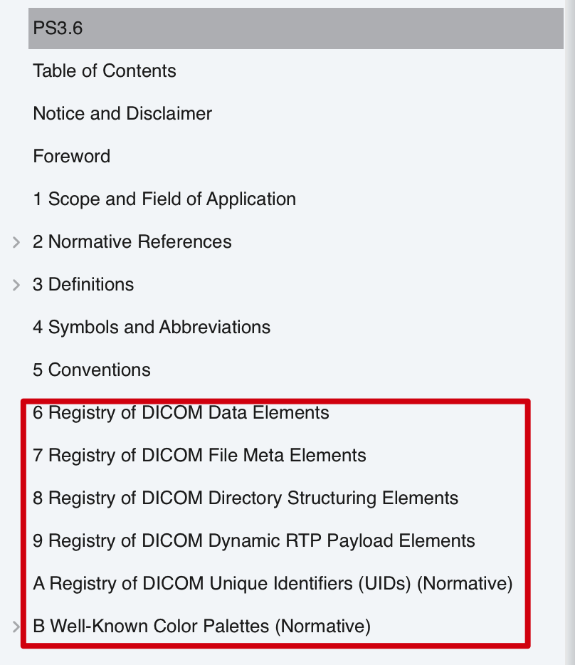
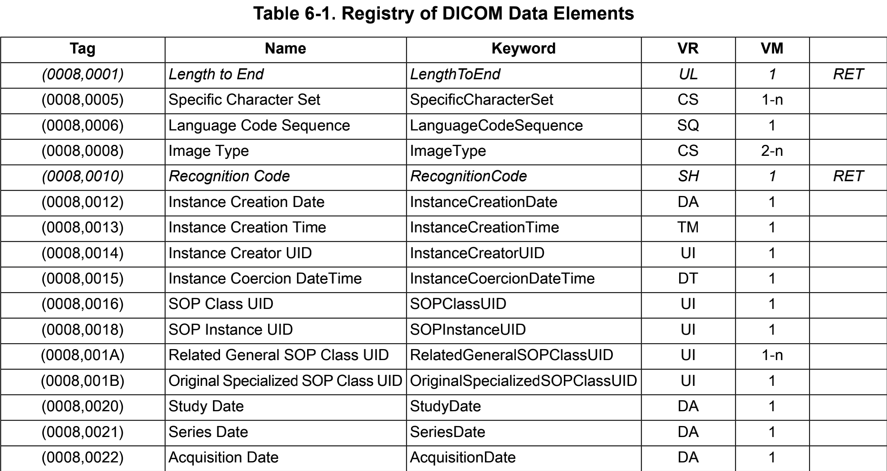
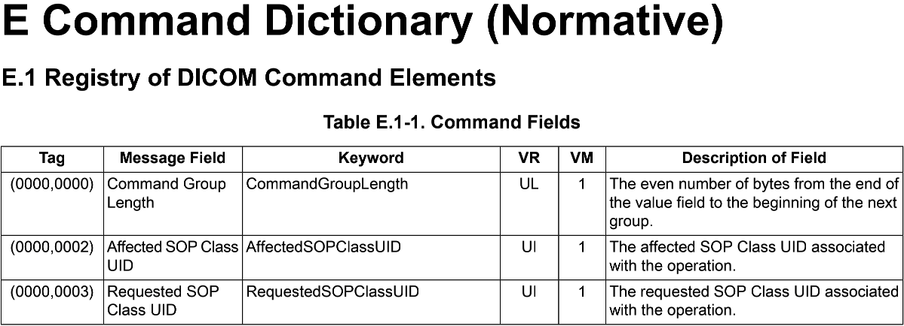

Data Dictionary
===============

标准DICOM Data Dictionary
-------------------------

**DICOM Data Dictionary本质上是对所有标准的医疗数据的一种注册。**
经过这么多年的发展积累，DICOM Data Dictionary中的数据条目已经多达2000多个，那么为了能够更加有效地管理这么多的item，DICOM对其进行了分组，而数据条目Item作为一个Element存在，这样通过group号和element号就可以确定一个item具体是哪一个内容了，通常表示为\ ``(Group, Element)``\ ，如\ ``(0008, 0009)``\ ，就是我们常说的Tag号。
**需要注意的是，所有DICOM设备和软件，都是通过Tag来识别属性，而不是属性名称，属性名称只是方便来读取和理解的。**

所有的group id和element id都是通过十六进制进行编码的，Tag号与属性名一一对应。
如下图所示，即为Data Dictionary的一部分，其中第一列为Tag号，通过它可以找到属性名，VR表示该属性的数据类型，VM表示这个属性可以有几个值，一般情况下有一个值就可以了，但是有些情况是不行的，比如(0010, 1001)这个属性，表示患者别名，有的患者可能有多个别名，这是时候就需要该属性有多个值。另外，当属性具有多个值的时候，如果数据类型为二进制类型，那么只需要将其简单的拼接起来就可以了，按照数据长度即可区分，而如果数据类型为文本类型，那么多个值就需要通过反斜杠进行连接，所以在DICOM当中，应该\ **十分谨慎地使用反斜杠**\ 。

.. note::

    可以这么理解VM：如果VM=1，表示Value是一个单个的值；如果VM > 1，表示Value是一个数组。

+----------------------+--------------------------------+----+-----+----------------+
| (Group, Element) tag | Attribute (Data element)  name | VR | VM  | Retried status |
+----------------------+--------------------------------+----+-----+----------------+
| *(0008, 0001)*       | *Length to End*                |    |     | RET            |
+----------------------+--------------------------------+----+-----+----------------+
| (0008, 0005)         | Specific Character Set         | CS | 1~n |                |
+----------------------+--------------------------------+----+-----+----------------+
|        ...                                                                        |
+----------------------+--------------------------------+----+-----+----------------+
| (0010, 0010)         | Patient Name                   | PN | 1   |                |
+----------------------+--------------------------------+----+-----+----------------+
| (0010, 0020)         | Patient ID                     | LO | 1   |                |
+----------------------+--------------------------------+----+-----+----------------+
| (0010, 0021)         | Issuer of Patient ID           | LO | 1   |                |
+----------------------+--------------------------------+----+-----+----------------+
| (0010, 0030)         | Patient's Birth Date           | DA | 1   |                |
+----------------------+--------------------------------+----+-----+----------------+
| (0010, 0032)         | Patient's Birth Time           | TM | 1   |                |
+----------------------+--------------------------------+----+-----+----------------+
| (0010, 0040)         | Patient's Sex                  | CS | 1   |                |
+----------------------+--------------------------------+----+-----+----------------+
| ...                                                                               |
+----------------------+--------------------------------+----+-----+----------------+
| (0010, 1000)         | Other Patient IDs              | LO | 1~n |                |
+----------------------+--------------------------------+----+-----+----------------+
| (0010, 1001)         | Other Patient Names            | PN | 1~n |                |
+----------------------+--------------------------------+----+-----+----------------+
| ...                                                                               |
+----------------------+--------------------------------+----+-----+----------------+
| (FFFE, EOOD)         | Item Delimitation Item         |    | 1   |                |
+----------------------+--------------------------------+----+-----+----------------+
| (FFFE, EODD)         | Sequence Delimitation Item     |    | 1   |                |
+----------------------+--------------------------------+----+-----+----------------+

通过斜体表示的属性为早起版本的DICOM数据，在将来可能不再支持。
这些属性不会再被重新定义，也有可能被其它字段替代，但作为一个好的DICOM应用，应该考虑到向前的兼容性，对斜体部分的属性做出适当的兼容。 

私有DICOM Data Dictionary
--------------------------

除了标准的DICOM属性，厂商还可以扩展属于自己的私有属性。
一般来说，DICOM中偶数Group Id表示标准的DICOM属性，奇数表示自定义私有的属性。
所以虽然我们定义的Tag在标准中不会描述，但是其它厂商通过Group Id可以轻松地判断这个属性是我们自己扩展出来的。
私有Tag的另一个问题就是，不同厂家可能用同一个Tag定义了不同的属性，导致在读取其它家数据的时候曲解Tag的意思，虽然DICOM协议作出了很大的努力避免这种问题，但并未完全排除这种问题。

.. note::

    一种比较常用的方法是先判断数据来源，再对私有Tag进行读取，可以避免误读。

标准DICOM Command Dictionary
----------------------------

前面所讲的内容都是关于数据属性的，那么，像打印、存储、移动这些指令是怎么进行编码的呢？
其实也很简单，Data Dictionary中Group Id为0000的是对指令的编码，该组中只包含DICOM指令，如(0000, 0010)表示指令类型，(0000, 0100)表示指令消息Id。
这里需要注意的是，DICOM中并不支持扩展私有Command Dictionary。

总结
----

* Data Dictionary在PS3.6中定义，包含了Data Elements、File Meta Element、Directory Structuring Elements、Dynamic RTP Payload Element、Unique Identifiers(UIDs)和Well-Known Color Palettes。

* 下图是截取的Data Elements的一部分：

* Command Dictionary在PS3.7 Annex E中定义，下图是截取的Command Dictionary的一部分：

