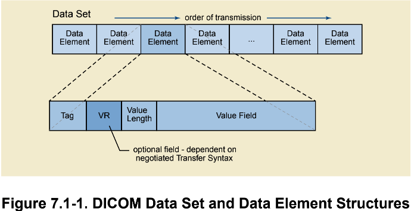

Data Structures and Encoding
============================

Value Encoding
--------------

A Data Set is constructed by encoding the values of Attributes specified in the Information Object Definition (IOD) of a Real-World Object.

在IOD中定义了一组属性 (Attribute)，对这些属性编码后得到的就是Data Set。

Value Representation (VR)
*************************

VR表示Data Element的数据类型。

Value Multiplicity (VM)
***********************

VM表示Data Element的Value Field是一个单独的值，还是一个数组。

The Data Set
------------

A Data Set represents an instance of a real world Information Object. 
A Data Set is constructed of Data Elements. 
Data Elements contain the encoded Values of Attributes of that object.

对一个IOD实例编码后得到的就是一个Data Set。
一个Data Set由一组Data Elements组成，一个Data Element对应IOD的一个Attribute。

Data Elements
*************

A Data Element is uniquely identified by a Data Element Tag. 
The Data Elements in a Data Set shall be ordered by increasing Data Element Tag Number and shall occur at most once in a Data Set.

在Data Dictionary中定义了Data Elements，一个Data Set中的Data Element是通过其在Data Dictionary中的Tag来标识的。
一个Data Set中的Data Elements应该根据Tag Id升序排列。

Two types of Data Elements are defined:

* Standard Data Elements have an even Group Number that is not (0000, eeee), (0002, eeee), (0004, eeee) or (0006, eeee).
* Priviate Data Elements have an odd Group Number that is not (0001, eeee), (0003, eeee), (0005, eeee), (0007, eeee) or (FFFF, eeee).

Group Id为偶数的Data Element，表示DICOM标准中定义的Data Element；
Group Id为奇数的Data Element，表示用户自定义的Data Element。

A Data Element shall have one of three structures. 
Two of these structures contain the VR of the Data Element (Explicit VR) but differ in the way their lengths are expressed, 
while the other structure does not contain the VR (Implicit VR). 
All three structures contain the **Data Element Tag**, **Value Length** and **Value** for the Data Element.

Data Elements Fields
++++++++++++++++++++

A Data Element is made up of fields. 
Three fields are common to all three Data Element structures; these are the Data Element Tag, Value Length, and Value Field. 
A fourth field, Value Representation, is only present in the two Explicit VR Data Element structures. 

* **Data Element Tag** 

An ordered pair if 16-bit unsigned integers representing the **Group Number** followed by **Element Number**\ .

* **Value Representation**

Two single byte characters containing the VR of the Data Element.

* **Value Length**

    - a 16 or 32-bit (dependent on VR and whether VR is explicit or implicit) unsigned integer containing the Explicit Length of the Value Field as the number of bytes (even) that make up the Value.
    - a 32-bit Length Field set to undefined Length (FFFFFFFFH).

* **Value Field**

An even number of bytes containing the Value(s) of the Data Element.

.. note::

    Value Field的长度必须是偶数，如果不是偶数，在末尾添加空格补足为偶数个。
