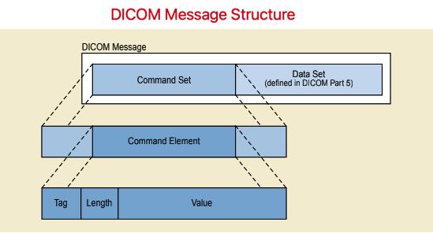

Message Exchange
================

Service Context
---------------

DICOM Communication Model for Message Exchange
**********************************************

* 在TCP/IP层之上的是DICOM Upper Layer，DICOM Upper Layer提供DICOM Upper Layer Service（ACSE），提供了和连接（Association）相关的服务，包括连接的建立、释放、数据的传输等；
* DIMSE提供服务

    - 一方面，DIMSE服务是通过DICOM Message实现的，DICOM Message是通过DICOM Upper Layer Service传输的；
    - 另一方面，SOP定义了DIMSE服务的接口（数据类型+操作类型），AE构建SOP Instances，请求DIMSE服务；构建SOP的两个基础是：IOD + Service Class。
* 在DICOM Standard中，已经定义了许多的IOD；IOD的属性，在Data Dictionary中定义；
* Data Set的数据结构和编码方式，在DataSet Structure and Encoding中定义;
* DICOM Message由两个部分组成：Command Set + Data Set，分别对应SOP的"S"和"O"。

整个流程可以简单总结为：AE以Service Class和IOD为基础，构建SOP Instances，请求DIMSE Service，DIMSE根据SOP Instances构建DICOM Message，然后使用DICOM Upper Layer Service传输DICOM Message。

The DICOM Application Layer Structure
*************************************

The heart of any DICOM Application Entity is specified by the following parts of the DICOM Standard:

* PS3.3, **Information Object Definitions**, which provides data models and Attributes used as a basis for defining SOP Instances that are operated upon by the services. (Such SOP Instances are used to represent real-world occurrences of images, studies, patients, etc.)
* PS3.4, **Service Class Specifications**, which defines the set of operations that can be performed on SOP Instances. Such operations may include the storage, retrieval of information, printing, etc.
* PS3.5, Data Structure and Encoding, which addresses the encoding of the Data Sets exchanged to accomplish the above services. 
* PS3.6, Data Dictionary, which contains the registry of DICOM Data Elements used to represent Attributes of SOP Classed.

.. note::

    IOD是对现实世界中的对象的数据抽象，是数据模型。IOD是组成SOP Instances的基础之一。

    Service Class Specifications定义了有哪些服务，而服务执行的对象就是SOP Instances（如果把服务看作是操作，那么SOP Instances就是数据，操作的对象是数据）。

    Date Structure and Encoding定义了Data Sets的数据结构和编码方式。

    Data Dictionary中则是DICOM标准中已经定义的Data Elements。

    SOP (Service-Object Pair)，O (Object)，即IOD，表示数据部分，S (Service)，表示对数据（IOD）执行的操作。
    如果用面向对象的概念来理解的话，O表示属性，S表示行为，SOP就是一个类。
    SOP Class定义了数据类型和数据的操作，SOP Instances则是SOP Class的实例。

    SOP可以看作是服务的接口，SOP定义了服务需要什么类型的数据以及会对数据执行的操作，客户端以IOD和Service Class为基础构建SOP Instances，请求DIMSE Service。

The DICOM Application Entity uses the services provided by DICOM Message Service Element.

.. note::

    DICOM Message Service Element (DIMSE)提供服务，DICOM AE使用这些服务。
    而服务的接口，是通过SOP定义的。
 
The DICOM Message Service Element specifies two sets of services:

* **DIMSE-C** supports operations associated with composite SOP Classes.
* **DIMSE-N** supports operations associated with normalized SOP Classes and provides an extended set of object-oriented operations and notifications.

.. note::

    IOD分为两种：Composite和Normalized；相应的SOP也分为两种：Composite SOP和Normalized SOP。
    因为SOP Instances是服务操作的对象，所以根据SOP的类型，DIMSE Service也分为两种：DIMSE-C和DIMSE—N。

**The DIMSE-C and DIMSE-N services are supported by a single DIMSE protocol that uses the DICOM-specific Message formatting end encoding.**

.. note::

    从逻辑上来说，DIMSE提供服务，DICOM AE使用这些服务。
    从实现上来说，DIMSE Service是通过DICOM Message实现的，DIMSE Protocol定义了DICOM Messaage的格式和编码规则。

DICOM Message Structure and Command Set
***************************************

Information is communicated across the DICOM network interface in a DICOM Message.
A Message is composed of a Command Set followed by a conditional Data Set. 
The Command Set is used to indicate the operations/notifications to be performed on or with the Data Set.

.. note::

    一个DICOM Message包括两个部分：Command Set和Data Set，其中Data Set是可选的。
    Command Set用来说明要执行的操作或通知，Data Set则是操作的对象，两者分别对象SOP的"S"和"O"。

A Command Set is constructed of Command Elements. 
Each Command Element is composed of an explicit Tag, a Value Length, and a Value Field. 

Command Set Structure
+++++++++++++++++++++

The Command Elements in a Command Set shall be ordered by increasing Command Tag number. 

.. note::

    Command Elements根据Tag升序排列。

A Command Element is composed of three fields: a Command Element Tag, a Value Length, and a Value Field.

* **Command Element Tag**: An ordered pair of 16-bit unsigned integers representing the Group Number followed by Element Number.
* **Value Length**: A 32-bit unsigned integer representing the explicit Length as the number of bytes (even) that make up the Value. It does not include the length of the Command Element Tag or Value Length fields.
* **Value Field**: An even number of bytes containing the Value(s) of the Command Element. 

.. note::

    Value Field的长度一定是偶数（even number），如果不是偶数则在末尾添加空格补齐为偶数。

    Value的VR、VM等信息，可以通过Command Element Tag在Command Dictionary中查找得到。

Example:

1. 下图是使用Wireshark抓包得到的一个Command Set示例：

2. 下图是截取Command Dictionary (PS3.7 Annex E)中的一部分：

可以看到，可以根据Tag在Command Dictionary中查找其对应的VR、VM、Description等信息。

Service Overview
----------------

DIMSE提供Service，DICOM AE使用这些Service，是DIMSE Service的使用者（DIMSE Service User）。

总的来说，DICOM采用的是C/S架构，Client向Server请求服务，Server返回响应信息。 

如果细分的话，DIMSE属于表示层：

.. image:: images/DIMSE_1.png
    :width: 640

**The DICOM Message Service Element supports communication between peer DIMSE Service Users.**

A DIMSE Service User acts in one of two roles:

* invoking DIMSE Service User
* performing DIMSE Service User

总体来说，DICOM采用C/S这种架构，有两个角色：Client和Server。
但是，对一次具体的服务来说，又有两个概念：invoking DIMSE Service User和performing DIMSE Service User。
invoking DIMSE Service User指调用服务的这一方，performing DIMSE Service User指提供服务这一方。
在一次具体的服务过程中，Client和Server都有可能是invoking DIMSE Service User或perfroming Service User。

.. image:: images/Invoking_and_Performing_DIMSE_Service_User.png
    :width: 640

如上图所示：

* 在客户端向服务端请求服务时，客户端是DIMSE服务的调用者，服务端是DIMSE服务的执行者，这时客户端是invoking DIMSE Service User，服务端是performing DIMSE Service User；
* 当服务端向客户端返回响应时，服务端是DIMSE服务的调用者，客户端是DIMSE服务的执行者，这时服务端是invoking DIMSE Service User，客户端是performing DIMSE Service User。

DIMSE Service Users make use of service primitives that are provided by the DIMSE Service Provider. 
The DIMSE Service Provider is an abstraction of the totality of those entites that provide DIMSE services to peer DIMSE Service Users. 
A service primitive shall be one of the following types:

* request primitive
* indication primitive
* response primitive
* confirmation primitive

These primitives are used as follows to successfully complete a DIMSE service:

* The invokingg DIMSE Service User issues a request a primitive to the DIMSE Service Provider.
* The DIMSE Service Provider receives the request primitive from the invoking DIMSE Service User and issues an indication primitive to the performing DIMSE Service User.
* The performing DIMSE Service User receives the indication primitive from the DIMSE Service Provider and performs the requested service.
* The Performing DIMSE Service User issues a response primitive to the DIMSE Service Provider.
* The DIMSE Service Provider receives the response primitive from the performing DIMSE Service User and issues a confirmation primitive to the invoking DIMSE Service User.
* The invoking DIMSE Service User receives the confirmation primitive from the DIMSE Service Provider completing the DIMSE service.

Service Types
*************

DIMSE provides two types of information transfer services that are used by DICOM Application Entites:

* **a notification service**

Notification services enable on DICOM Application Entity to notify another about the occurrence of an event or change of state.

* **a operation service**

Operation services enable one DICOM Application Entity to explicitly request an operation to be performed unop a SOP Instance managed by another DICOM Application Entity.

DIMSE Service User Interaction
******************************

The DICOM Message Service Element receives notification and operation requests and their related information from the DIMSE Service User. 
Two DICOM Application Entities take the roles as peer DIMSE Service Users in order to exchange notifications and operations. 

DIMSE Service User之间的交互过程：一端的DIMSE Service User向DIMSE请求服务，DIMSE将服务请求及相关的数据传输给另一端的DIMSE Service User。

Service Modes
*************

Operations and notifications, on an Association, are used in one of the following two modes:

* **synchronous**

In the synchronous mode, the invoking DIMSE Service User, on an established Association, requires a response from the performing DIMSE Service User before invoking another operation or notification.

.. note::

    在同步模式下，在一个request收到对应的response之前会一直等待，直到收到response之后才会进行下一次的operation或notification。
 
* **asynchronous**

In the asynchronous mode, the invoking DIMSE Service User, on an established Association, may continue to invoke further operations or notifications to the performing DIMSE Service User without awainting a response.
In the asynchronous mode, the performing DIMSE Service User may respond to the operations or notifications in a different order than they were received. 

.. note::

    在异步模式下，在一个request发出之后，不会等待它的response，而是继续执行后面的操作。
    response返回的顺序和request发出的顺序可能并不一致。

The mode selection (synchronous or asynchronous) is determined at Association establishment time. 
The synchronous mdoe serves as the default mode and shall be supported by all DIMSE Service Users.

DIMSE Services
**************

.. note::

    根据前面的介绍，DIMSE提供Services，DIMSE Service User使用这些Services。
    DIMSE提供了哪些Services呢？这就是这里要介绍的内容。

DIMSE Services可以分为两种:

* **DIMSE-N**\ : those services applicable to **Normalized SOP Instances**

The DIMSE-C services allow a DICOM Application Entity to explicitly request an operation by another DICOM Application Entity on Composite SOP Intances.

DIMSE-C provides only operation services.

* **DIMSE-C**\ : those services applicable to **Composite SOP Instances**

The DIMSE-N services provide both notification and operation services applicable to Normalized SOP Instances.

.. image:: images/DIMSE_Services.png
    :width: 640
    :alt: DIMSE Services

DIMSE Procedures
****************

All DIMSE operations and notifications are confirmed services. 
The performing DIMSE Service User shall report the response of each operation or notification over the same Association on which the operation or notification was invoked. 

.. note::

    DIMSE所有的服务请求都需要有response。

Sub-Operations
++++++++++++++

Some DIMSE services are atomic in that ther service is performed by one operation or notification. 
In such a case the DIMSE service primitives are used by peer DIMSE Service Users to invoke and perform the operation or notification. 

Other DIMSE services require the use of one or more sub-operations to perform the service. 
In such cases DIMSE service primitives are used by peer DIMSE Service Users to invoke and perform each sub-operation. 
How and when the sub-operation service primitives are used is defined by the procedures for the DIMSE service.

.. note::

    有些服务是“原子”的，只需要一个operation或notification就可以完成。
    而有些服务需要多个子操作（sub-operations）才可以完成。

Multiple Responses
++++++++++++++++++

Each DIMSE service requires one or more response primitives as a result of the invocation of the service. 
How and when the multiple response primitives are used is defined by the procudures for the DIMSE service. 
Whether multiple responses are returned is conditional upon the information included in the request primitive by the DIMSE Service User. 

.. note::

    每一个服务请求都需要有response，而且有时可以有多个response (multiple responses)。

Cancellation
++++++++++++

Certain DIMSE services permit the cancellation of the service through the use of service primitives. 
This allow an invoking DIMSE Service User to request termination of a DIMSE service after completion of the request service primitive but prior to completion of the confirm service primitive.

.. note::

    有些DIMSE服务，可以在request发出之后，response返回之前，取消服务。

Protocol Overview
-----------------

DIMSE Protocol
**************

The DIMSE protocol machine defines the procedures and the encoding rules necessary to construct Messages used to exchange command requests and responses between peer DICOM Service User.

.. note::

    从逻辑上来说，DIMSE提供服务；服务的实现，是通过传输DICOM Message；
    DIMSE Protocol定义了如何去构建一个DICOM Message，以及DICOM Message的传输。

The DIMSE protocol machine accepts DIMSE Service User request and response service primitives and constructs Messages. 
The DIMSE protocol machine accepts Messages and passes them to the DIMSE Service User by the means of indication and confirmation service primitives.

.. note::

    DIMSE Protocol接收request and response pritimives，并据此来生成DICOM Message。
    DIMSE Protocol还通过使用indication and confirmation service primitives将DICOM Messages传输给对端的DIMSE Service User。   

Procedures define the rules for the transfer of Messages that convey command requests and response.

Messages may be fragmented.

.. note::

    DICOM Message在构建的时候可能会被为不同的段（Command Fragments and Data Fragments）。
    在使用ACSE的P-DATA服务传输DICOM Message时，DICOM Message的每一个段对应P—DATA-TF PDU的Variable Field的一个PDV。

    DICOM Messages are encapsulated in P-DATA request primitives as the use data of Presentation Data Values (PDV). 
    A DICOM Message is fragmented in Command Fragments and Data Fragments, each placed in a PDV.

The invoking DIMSE Service User request primitive results in a Message Carrying a Command Request (with an optional associated Data Set). 
Each Message includes an indication primitive to the performing DIMSE Service User.

The performing DIMSE Service User response primitives result in a Message carrying a Command Response (with an optional associated Data Set). 
Each Message includes a confirmation primitive to the invoking DIMSE Service User.

.. note::

    request primitive会生成一个DICOM Message，

    response primitive也会产生一个DICOM Message，

Association Protocol
********************

The establishement of an Association invovles two DIMSE Service Users, one that is the Association requester and one that is the Association-acceptor.
A DIMSE Service User may initiate an Association establishment by using the A-ASSOCIATE service.

.. note::

    DICOM Message的传输是建立在Association（DICOM连接）之上的。

