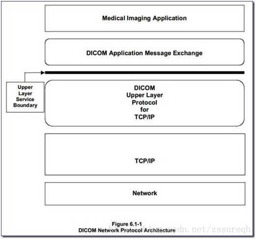

DICOM网络通信模型
=================

初学DICOM，可能以为DICOM协议就是扩展名为DCM的文件的格式说明。
其实不然，DCM文件只是DICOM协议一部分中的一小节，仅仅是整个协议中的一个数据结构。
DICOM协议更多的是关于医疗行业各种服务及相关流程的约定，因此其实DICOM协议中最主要的是信息流，是对医院整体运作流程的约定。

可以大致的将DICOM分为两大类：

* DICOM医学图像处理，即DCM文件中具体数据的处理，说图像可能有些狭隘，广义上还包括波形（心电）、视频（超声）等；
* DICOM网络传输，主要描述信息在医院各系统之间的交互方式以及传输格式。

DICOM网络通信，该部分是日常患者到医院就诊等具体流程的抽象，是DICOM标准的核心。

DICOM网络服务是建立的传统OSI七层模型之上的端到端的通讯服务，包括服务端和客户端。
其基本的通讯服务模型如下图所示：

.. image:: images/communication_model_1.jpeg

* DICOM协议层：创建DICOM连接，并在此连接上实现数据的收发（这里只是进行数据的收发，而不关心数据的含义）。
* DIMSE协议层：定义了消息的格式和含义。

.. image:: images/communication_model_2.jpeg

与传统的OSI七层模型对比一下，可以看出DICOM 3.0标准中所描述的DICOM网络通讯服务所包含的并非是OSI七层中简单的某一层，而是对从TCP/IP层向上的各层都分别进行了详细的描述和定义。

DICOM 3.0标准对DICOM网络通讯的描述
----------------------------------

下面是DICOM 3.0标准中的几个附图，首先从整体上对DICOM网络通讯有一个认识：

.. image:: images/communication_model_3.jpeg 

可以看出，DICOM通讯模型是建立在TCP/IP层之上的，最底层的是DICOM Upper Layer Protocol，该部分主要负责与TCP相对接，在此之上就是DICOM3.0标准给出的DICOM通讯模型。
与OSI七层模型对比可知，DICOM通讯模型涵盖了会话层（Session）、表示层（Presentation）和应用层（Application）。
会话层（Session）主要负责为通讯双方指定通讯方式，并创建、注销会话，该部分对应的是ACSE服务，即DICOM3.0标准中的第8部分。
表示层（Presentation）能为不同的客户端提供数据和信息的语法转换内码，使系统能够解读成正确的数据。同时，也能够提供压缩解压、加密解密，与之对应的是DIMSE服务，即DICOM3.0标准的第7部分。

下面给出一个更全面的结构示意图：

.. image:: images/communication_model_5.jpeg

******

参考文章：

`DICOM医学图像处理：全面分析DICOM3.0标准中的通讯服务模块 <https://blog.csdn.net/zssureqh/article/details/39098621>`_

