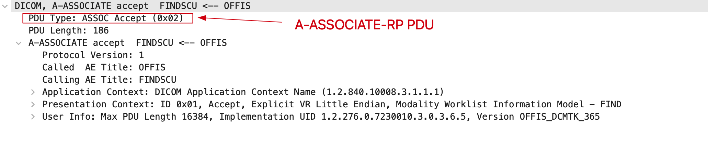
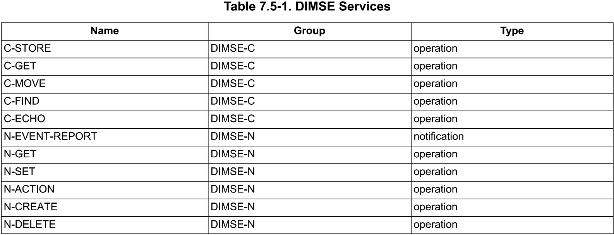

DICOM网络传输
=============

概述
----

DICOM采用C/S模型来描述网络传输：客户端（Client）连接到服务端（Server），然后使用服务端提供的各项服务（Services）。不同于传统网络连接，DICOM中的Server叫做\ **Service Class Provider (SCP)**\ ，Client叫做\ **Service Class User (SCU)**\ 。

想要建立DICOM连接（\ **Association**\ ，传统OSI模型中叫做Connection），客户端会向服务端发送连接请求消息，该消息描述客户端此次连接所期望的DICOM服务及相关设置；随后服务端会查看客户端发送过来的请求，确认自己是否支持客户端请求的相关服务并给出反馈信息。

响应信息主要分为以下几类：
 
* 如果服务端支持客户端请求的某些服务，服务端会发送确认信息（Association Acknowledge），表明此次连接完成；
* 否则发送拒绝消息（Association Reject），通知客户端连接失败。

一旦网络连接建立，客户端和服务端就可以进行信息（DIMSE消息，DIMSE-C/DIMSE-N）交互了。
根据连接信息的不同，提供的DIMSE信息类型也不同。例如，传输一幅DICOM图像到服务端进行归档，使用的是C-STORE DIMSE；如果希望通过病人姓名和出生日期来查询病人的档案，需要使用C-FIND DIMSE。

.. note::

    和传统的网络通讯一样，DICOM网络通讯的第一步是建立连接，然后在该连接上传输数据。

DICOM Network Protocol Architecture
-----------------------------------

DICOM Upper Layer Services
--------------------------

DICOM Upper Layer提供了\ **Upper Layer Services**\ ，通过使用这些服务，可以建立DICOM连接（Association) ，并在该连接上传输数据。

A-ASSOCIATE Service
*******************

A-ASSOCIATE Service用于在两个AEs之间建立DICOM连接（Association）。
客户端（SCU）向服务端（SCP）发送A-ASSOCIATE服务请求，请求建立连接。

The parameters for A-ASSOCIATE Service: 

在请求A-ASSOCIATE Service时，有些参数是必需的，比较重要的参数有：

* **Calling AE Title**
* **Called AE Title**
* **Application Context**
* **Presentation Contexts**
* **User Information**

A-RELEASE Service
*****************

A-RELEASE Service用于”优雅的“断开DICOM连接（Association）。
所谓“优雅的”，就是Requestor会先发送一个断开连接的请求，Acceptor接收到断开请求并响应之后，连接才会断开。

A-ABORT Service
***************

A-ABORT Service用于”粗暴的“断开DICOM连接。
所谓”粗暴的“，就是直接断开，没有Request-Response这个过程。

.. image:: images/Association_User_Initiated_Abort.png
    :width: 640
    :alt: Association User Initated Abort

A-P-ABORT Service
*****************

A-P-ABORT Service由Service Provider使用来断开当前的DICOM连接。

.. note::

    A-RELEASE和A-ABORT是由Service User使用的，而A-P-ABORT是由Service Provider使用的。

P-DATA Service
**************

P-DATA Service用来实现数据传输（传输DICOM Messages）。

The parameter for the P-DATA Service:

对于P-DATA Service，其参数就是要传输的数据（DIMSE）。

DICOM网络通讯
-------------

通讯的第一步是建立连接。

请求连接
********

客户端（SCU）向服务端（SCP）发送连接请求（A-ASSOCIATE Service），请求信息中需要包含一些必要的消息，比较重要的信息有：

* **Calling AE Title**：请求端实体名称
* **Called AE Title**： 被请求实体名称
* **描述上下文（Presentation Contexts）**：是一个服务清单（List of Services），用于描述客户端希望从服务端获得的各项服务，每一项服务主要包括SOP Class和List of Transfer Syntaxes。

一些相关概念的介绍：

ACSE
++++

ACSE（Association Control Service Element），是在DICOM3.0中的第8部分介绍的，该部分的标题为Network Communication Support for Message Exchange，因此可以断定ACSE主要应用在用户建立连接阶段。

.. note::

    ACSE是一个标准的OSI协议，上面介绍的Upper Layer Services是ACSE的一个子集。

连接（Association）的建立是两个DICOM实体（AE）之间进行交互的第一步，AEs在建立的连接上进行数据编码格式、传输方式的协商。DICOM AEs利用ACSE-ASSOCIATION服务来建立连接，在ACSE-ASSOCIATION服务中主要用到的是Applicaiton Context、Presentation Context和User Information Items。ACSE服务主要有A-ASSOCIATE、A-RELEASE、A-ABORT、A-P-ABORT、P-DATA五类，对应的PDU有A-ASSOCIATE-RQ、A-ASSOCIATE-AC、A-ASSOCIATE-RJ、A-RELEASE-RQ、A-RELEASE-RP、A-ABORT、P-DATA-TF七种。

AE Title
++++++++

在DICOM网络中，每一个DICOM系统都会被分配一个名称，即Application Entity Title，简称AE Title。
AE Title用于标识DICOM网络中的唯一（Unique）DICOM系统（有点类似于互联网中的IP地址），因此在一个DICOM网络环境中，要确保每一个DICOM系统拥有唯一的名称 --- 这个工作通常由DICOM网络管理员来完成。AE Title最长不超过16个字符，通常在实际应用过程中都采用大写字母来表示，当然也可以使用小写字母以及其它ASCII码。在建立连接过程中，客户端会发送自己的AE Title（即Calling AE Title）以及服务端的AE Title（即Called AE Title）。

Application Context
+++++++++++++++++++

An Application Context explicitly defines the set of application service elements, related options and any other information necessary for the inter working if Application Entities on an Association; 
**in particular, it specifies the DIMSE Protocol used by the Application Layer.**

Two Application Entities establish an Association by agreeing on an Application Context. The requestor for an Association proposes an Application Context Name and the acceptor returns either the same or a different Application Context Name. The returned name specifies the Application Context to be used for thi application.

Application Context用来在Association Negotiation阶段说明接下来在Association上传输的是什么消息（也可以说用来说明应用层使用的是什么协议）。
例如，在DICOM中，就是用来说明Association上传输的是DIMSE Message。

A single DICOM Application Context Name is defined for this version of this Standard. This name is "1.2.840.10008.3.1.1.1".

对于当前的DICOM标准，Application Context Name定义为"1.2.840.10008.3.1.1.1"(DICOM Application Context Name)，表示应用程序中使用的是DIMSE Protocol。

.. note::

    Application Context Name

    This UID just says in association negotiation "We talk about DICOM". 
    1.2.840.10008.3.1.1.1 It defines that in further communication within the association context 
    DICOM rules apply such as using DIMSE commands like C-STORE and so on. 

Presentation Contexts
+++++++++++++++++++++

DICOM协议已经有20多年的历史，从1993年DICOM标准提出以来，新的网络连接不断被添加到DICOM协议中。
例如1996年引入的MWL服务，即Modality Worklist Service。因此\ **大多数DICOM系统只支持DICOM标准中的部分服务**\ ，例如PACS（Picture Archieving and Communication System，图片存档及通信系统）往往就不会提供MWL服务。不同的DICOM服务用于不同的目的，客户端会向服务端发送其希望获得的服务，而服务端会查看其提供的各项服务是否是客户端所期望的来决定是否提供。

.. note::

    因为大多数DICOM系统只支持DICOM标准中的部分服务，所以客户端和服务端之间需要有一个协商的过程，以确定客户端期望获得哪些服务，而服务端又支持哪些服务。

鉴于以上原因，客户端会向服务端发送一系列被称为\ **描述上下文（Presentation Context）**\ 的消息列表，每一个描述上下文代表一种客户端期望的服务。客户端用DICOM标识符来标识每种服务，即SOP Class UID（Service-Object Pair Class Unique Identifier）。在请求连接的上下文中，被发送的SOP Class 也被叫做\ **Abstract Syntax**\ （一定要与Transfer Syntaxes区分开来）。在传输SOP Class UID（即Abstract Syntax）的同时，会发送与该服务对应的数据部分的编码格式，即\ **Transfer Syntaxes**\ 。以乳腺检查的X光片为例，通常乳腺X光片很大，需要进行压缩。客户端在向服务端发送上下文信息时会提供给服务端一种乳腺X光片的压缩格式，例如JPEG2000，同时也会提供一种被大多数图像传输服务端接受的非压缩格式。如下图所示：

该客户端向服务端发送了三种上下文信息，每一个上下文信息包含一种客户端期望的服务以及相关的多种传输方式。
例如Presentation Context ID 1中描述了一种数字乳腺X光片存储服务，同时提供了两种编码格式：Implicit VR Little Endian和JPEG 2000。在客户端用奇数来标示每种上下文信息（最小编号为1，最大为255），通常从1号开始单调递增，1、3、5、.....。至于每种上下文信息之间的顺序以及其内部编码格式的顺序可自由设定。通过上图可以看出，每种服务都必须提供Implicit VR Little Endian编码格式，因为这是DICOM中默认的传输编码格式。

User Information
++++++++++++++++

User Information和Applicaiton Context相关。Application Context说明Association上传输的是哪种类型的消息，User Information用来说明该种类型消息相关的一些参数。

.. note::

    This parameter is used to carry initializition information for the DICOM Application Entities as defined in the application context specified by the value of the accompanying Application Context Name parameter.

    **可以将User Information理解为Application Context parameter。**

请求连接响应
************

服务端在接受到客户端的连接请求之后，随后会向客户端发送连接响应信息，连接响应信息有三种状态：

* **接受**
* **拒绝（短暂的）**
* **拒绝（永久的）**

当连接响应信息为接受时（即Accepted），服务端会对客户端请求的各个上下文信息（Presentation Context）进行确认，是接受还是拒绝，然后在响应消息中把结果返回给客户端。

Exmaple:

在上图所示中，客户端给出了5种描述上下文，ID为1、3、5、7、9，然而在服务端只支持其中的三种（ID为1、3、9），并且对于每一种Abstract Syntax服务端只支持其中的一种Transfer Syntax。

如果客户端请求的Presentation Context被拒绝，服务端不会进一步发送任何消息。如果接受了某个Presentation Context，服务端会选择其中的一个Transfer Syntax添加到返回信息对应的Presentation Context中以通知客户端。如果没有Presentation Context被接受，那么会发送拒绝消息，此时结果代码为Rejected。当连接建立完成后，开始准备传输数据体。

如果结果状态码为"Rejected (permanent)"表明服务端通知客户端它的请求被拒绝了，后续也会被拒绝。
出现这种情况的原因通常有两种，一种是请求的AE Title并不存在，也就是说网络中不存在该实体；
另一种是服务端不支持客户端请求的任何服务（即SOP Class）。
在拒绝的情况下，SCP可以有选择的返回Diagnostic状态码以通知客户端被拒绝的原因；最差的情况下，SCP只返回"Calling AE Title not recognized"。在拒绝连接状态下，DICOM连接就终止了，SCP和SCU无法传输数据，与此同时底层的TCP连接也会关闭直到SCU再一次发送连接请求。

释放（终止）连接
****************

在连接建立后，连接双方开始进行数据交换。如果任何一方想终止连接（服务器也可以），有两种方式：

* A-RELEASE Service
* A-ABORT Service

第一种情况下，接受到连接释放消息的一方会向释放方发送一条确认消息。随后关闭TCP连接，DICOM连接终止，这是DICOM网络连接中的正常的关闭方式。
第二种情况，客户端发送完终止消息后，不等到服务端的确认就主动关闭TCP连接，这种是不正常的，通常是客户端遇到意外情况后发生的，这是DICOM中唯一的一种不需要服务端发送响应消息的请求。当然还有第三种 终止方式，就是直接关闭TCP连接，这种情况往往是由于硬件错误所导致的。

数据交换
********

利用ACSE消息成功建立DICOM连接之后，即客户端发送的请求至少有一种上下文描述的服务被服务端接受，真正的数据开始交换。例如一张或多张CT图像、worklist查询、打印请求等。DICOM协议规定了11种DIMSE消息，每种都可以作为客户端的请求或者服务端的响应。11种DIMSE消息如下：

* C-STORE
* C-GET
* C-MOVE
* C-FIND
* C-ECHO
* N-EVENT-REPORT
* N-GET
* N-SET
* N-ACTION
* N-CREATE
* N-DELETE

.. note::

    先建立一个DICOM连接，然后在此连接上收发DIMSE消息。

PDU and PDV
+++++++++++

在DICOM Upper Layer会将传输的消息分割成多个片段，叫做Protocol Data Unit，简称PDU。
PDU的大小也是在连接建立过程中协商的。

The DICOM UL protocol consists of seven Protocol Data Units:

* A-ASSOCIATE-RQ PDU
* A-ASSOCIATE-AC PDU
* A-ASSOCIATE-RJ PDU
* P-DATA-TF PDU
* A-RELEASE-RQ PDU
* A-RELEASE-RP PDU
* A-ABORT PDU

根据使用的Upper Layer Services（A-ASSOCIATE Request/Response、A-RELEASE Request/Response、A-ABORT、P-DATA-TF）的不同，消息会被分割为相应类型的PDU(s)。

.. note::

    + PDU指的是在DICOM连接之上传递的消息片段，"If such a message is transfered on a DICOM connection, they are cut into pieces, so called Protocol Data Unit (PDUs)." --- 这里需要注意的是message，并不仅仅指我们所说的DICOM Message，还包括了ACSE协议中使用的连接消息，如A-ASSOCIATION-RQ、A-SSOCIATION-RSP，A-ABORT。

    + 对于P-DATA-TF PDU(s)，每一个PDU片段会包含一个与Presentation Context相关的数字。我们可以将每一个Presentation Context看作双方交流的逻辑通道，通过在PDU中包含Presentation Context ID，接收端才知道PDU属于哪一个通道，才能将多个PDU片段进行重组。

Example:

1. A-ASSOCIARE-RQ PDU

2. A-ASSOCIATE-RP PDU

3. P-DATA PDU

4. A-RELEASE-RQ PDU

5. A-RELEASE-RP PDU

**PDU指的是DICOM协议中的传输的各种消息（包括ACSE和DIMSE）的片段，PDV专指DICOM Message被分割后的片段，属于P-DATA-TF类PDU的Variable Field部分。**

DICOM Messages are encapsulated in P-DATA request primitives as the use data of Presentation Data Values (PDV). 
A DICOM Message is fragmented in Command Fragments and Data Fragments, each placed in a PDV. 

我们通过DICOM UL Services的P-DATA-TF Service来传输数据，也就是DICOM Messages。
DICOM Messages就是P-DATA Request的参数部分，也把它叫做PDV。
在把DICOM Message放入P-DATA Request的参数部分时，会对DICOM Message进行分段。
DICOM Message由Command Fragments和Data Fragments组成，每个Command Fragment或Data Fragment对应一个PDV。

.. note::

    DICOM Message = Command Set + Data Set组成，Command Set和Data Set又可以划分为不同的Fragments。

    PDV可以理解为片段化后的DICOM Message，是P-DATA Request的参数部分。

.. image:: images/DICOM_Message_Structure.png
    :width: 640
    :alt: DICOM Message Structure

Example:

ACSE vs DIMSE
+++++++++++++

连接（Association）的建立是两个DICOM实体（AE）之间进行交互的第一步，AEs在建立的连接上进行数据编码格式、传输方式的协商。
DICOM AEs利用ACSE-ASSOCIATE服务来建立连接，在ACSE-ASSOCIATE服务中主要用到的是Application Context、Presentation Context和User Information Items。
ACSE服务主要有A-ASSOCIATE、A-RELEASE、A_ABORT、A-P-ABORT、P-DATA五类，对应的PDU有A-ASSOCIATE-RQ、A-SSOCIATE-AC、A-ASSOCIATE-RJ、P-DATA-TF、A-RELEASE-RQ、A-RELEASE-RP、A-ABORT七种。

DIMSE是对DICOM传输消息的规定。
DICOM服务类型有C_STORE、C-GET、C-MOVE、C-FIND、C-ECHO、N-EVENT-REPORT、N-GET、N-SET、N-ACTION、N-CREATE、N-DELETE，如下图。

有上述对比可以看出ACSE是DIMSE的基础，DIMSE是在ACSE之上实现的。
DIMSE Message是在Association建立完成后，通过ACSE中的P-DATA-TF服务来传输，各种DIMSE消息会被分割成PDVs放入到P-DATA-TF的Variable Field。
如下图所示：

DIMSE Message Data
++++++++++++++++++

每种DIMSE消息所传输的内容各有不同，请求消息（Request）中主要包括：

* Message Type：表示消息的类型，对应DIMSE的11中消息类型，还会区分Request/Response。
* Message ID：在连接中每个消息的唯一标识。
* Presentation Context ID：表示该消息对应的描述上下文（对应在建立连接阶段，Client所请求的Presentation Contexts）。
* Affected SOP Class ID：DIMSE消息中指定的SOP Class，即Presentation Context中指定的Abstract Syntax。可以理解为处理该消息的是哪一种SOP类型。
* Affected SOP Instance UID：处理该消息的是哪一个SOP实例。
* Priority：消息的优先级，分为HIGH、NORMAL、LOW三种，但是大多数接收端都忽略。
* Data Set：传输的数据。

Example - DIMSE Request Message：

响应消息（Response）内容与上述类似。首先包括一个状态信息（DIMSE Status），例如0表示成功；例外与Message ID对应的是Message ID Being Responded To，表示该响应对应的是哪一个Request消息，通过拷贝并返回请求端的Message ID，使得接收端知道响应消息的目标。

Example - DIMSE Response Message：

验证通讯过程
------------

使用DCMTK开源库中提供的工具，来测试验证DICOM的通讯过程。

选用的工具如下：

+--------------+---------------+
| 服务端       | 客户端        |
+--------------+---------------+
| ``wlmscpfs`` | ``findscu``   |
+--------------+---------------+

另外，为了与DIMCOM3.0中对DICOM网络服务的各种结构（如DIMSE、PDU）和指令（A-ASSOCIATION、C-FIND）的详细介绍进行对比，将本地模拟的服务端与客户端的通讯数据进行抓取，将抓取的数据包存成pcap文件，然后利用Wireshark强大的统计分析功能进行直观的对比。

worklist查询服务的通讯过程分析
******************************

.. note::

    下载dcmtk的源码，在dcmtk/dcmwlm/data/路径下，有两个目录：wlistdb和wlistqry，其中存放的文件可以用来进行worklist查询服务测试。
    如果将dcmtk源码编译安装，这两个目录的默认安装路径为：/usr/local/share/dcmtk/

    wlistdb和wlistqry目录下的文件都是\ ``*.dump``\ 格式的，需要先将其转换为\ ``*.wl``\ 格式的，dcmtk有提供专门的命令行工具进行转换。
    例如，将wlistdb/OFFIS/目录下的wklist1.dump文件转换为wklist1.wl，执行以下命令：\ ``dump2dcm -g wklist1.dump wklist1.wl``\ ，用类似的方法可以将其它的*.dump格式的文件也转换为*.wl文件。
    具体的说明可以查看wlistdb/和wlistqry/目录下的README。

* 启动本地回路抓包工具（Wireshark或tcpdump）
* 启动worklist服务端程序

.. code-block:: sh
    :emphasize-lines: 1

    wlmscpfs -d 104 -dfp wlistdb/ 2> worklist-server.txt

* 启动worklist查询客户端程序

.. code-block:: sh
    :emphasize-lines: 1

    findscu -d 127.0.0.1 104 wlistqry.wl -aec OFFS 2> worklist-client.txt

以上两行命令的大概过程是：客户端根据指定的查询文件向服务器发起查询操作，服务器接受到客户端的查询请求后，在指定的路径下查询数据库文件，之后将结果返回给客户端。

然后再对Wireshark抓取的数据进行分析：

* 整个通讯过程：

* A-ASSOCIATE Request:

* A-ASSOCIATE Response:

* P-DATA Request Command Set:

* P-DATA Request Data Set:

* P-DATA Response Command Set:

* P-DATA Response Data Set:

* P-DATA Response End:

* A-RELEASE Request:

* A-RELEASE Response:

******

参考文章：

`DICOM医学图像处理：DICOM网络传输 <https://blog.csdn.net/zssureqh/article/details/41016091>`_

`DICOM医学图像处理：全面分析DICOM3.0标准中的通讯服务模块 <https://blog.csdn.net/zssureqh/article/details/39098621>`_

